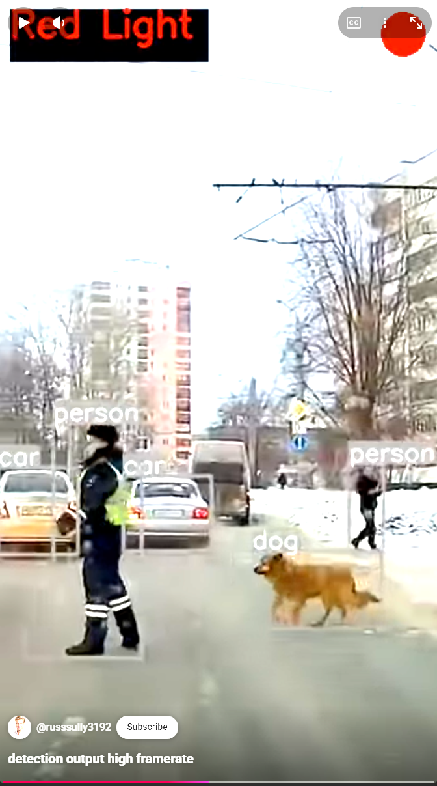

# Vision-Based Traffic Light Control Using YOLOv8 for Detecting Moving Vehicles, Pedestrians, and Animals

## Overview
This project aims to detect moving cars, cats, and dogs using computer vision as part of a smart traffic light controller to direct traffic accordingly.

## Introduction
Modern traffic management systems benefit from advanced computer vision algorithms capable of recognizing objects and their movements. This project explores the application of machine learning frameworks to detect moving vehicles and animals, seeking to automate the direction of traffic lights based on real-time data.

## Methodology

### Experiment & Algorithm
The project is implemented entirely in Jupyter Notebooks, which typically suggests an emphasis on step-by-step data processing, visualization, and algorithmic experimentation. While the exact algorithm details are not explicitly stated in the available materials, projects of this nature commonly use convolutional neural networks (CNNs) or pre-trained models for object detection and motion analysis.

### Tools & Frameworks
- **Programming Language:** Python (within Jupyter Notebook)
- ** Libraries used:**
  - **OpenCV:** For real-time computer vision and image processing.
  - **PyTorch or TensorFlow:** For deep learning and object detection.
  - **NumPy/Pandas/Matplotlib:** For data processing and visualization.
- **Project Files:** The primary work is contained in `.ipynb` files.

## Inputs, Outputs, and Steps

### Inputs
- **Video streams or image files:** Footage from traffic scenes containing cars, cats, dogs, and possibly other objects.

### Outputs
- **Detection labels and positions:** The system marks detected objects in video frames.
- **Traffic control signals:** Decisions on whether a traffic light should change, based on object detection and movement.

### Steps
1. **Data Acquisition:** Collect/upload video footage or images of street scenes.
2. **Preprocessing:** Frame extraction, resizing, possibly background subtraction for motion detection.
3. **Object Detection:** Apply pre-trained or custom-trained models to identify cars, cats, and dogs.
4. **Movement Analysis:** Determine which detected objects are moving and their trajectories.
5. **Traffic Logic:** Based on detections, trigger rules for traffic light control (e.g., stop or allow traffic).
6. **Visualization:** Display detected objects and their classes on the video/images.

## Results 

## Conclusion
This project demonstrates the integration of computer vision and machine learning for practical traffic management applications. By identifying moving vehicles and animals, the system can autonomously manage traffic flows, potentially improving safety and efficiency.

---

For the actual code, Jupyter Notebooks in the repository provide further explanations and step-by-step implementations

